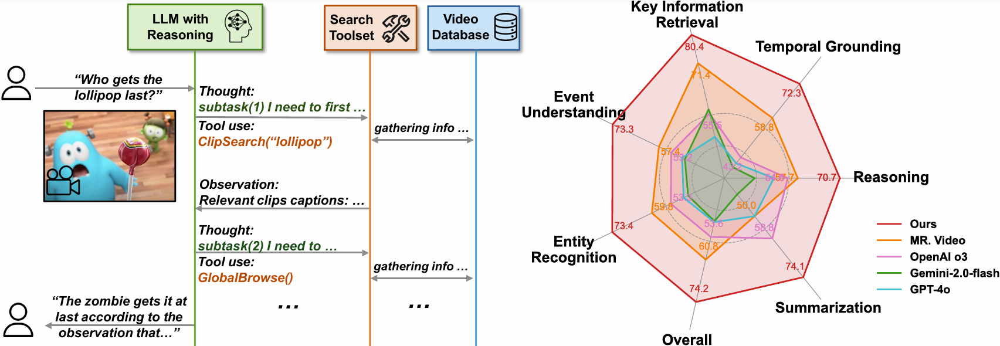

# Deep Video Discovery: Agentic Search with Tool Use for Long-form Video Understanding

[](https://arxiv.org/abs/2505.18079)
[](https://opensource.org/licenses/MIT)
[](https://87fc7dc81d4b38ed01.gradio.live)


This repository contains the official implementation of the paper [Deep Video Discovery: Agentic Search with Tool Use for Long-form Video Understanding](https://arxiv.org/abs/2505.18079), which achieves the state-of-the-art performance by a large margin on multiple long video benchmarks including the challenging [LVBench](https://lvbench.github.io/).


## Update

- **2025/08/04**: Upload captions on benchmarks for reproduction: [LVBench](https://1drv.ms/u/c/f029f6f5a52c17c4/ETR7ogx7YCtBgtDu66a4R14B7RKLZJoz20D4Z5I1KD6HTg?e=404kKg), [LVBench w/ transcripts](https://1drv.ms/u/c/f029f6f5a52c17c4/EcqO2lC_hRxGn-0t0IBNKZcBts3HDCEg8mZo4ltN6kXFUQ?e=XmabUn), [Video-MME](https://1drv.ms/u/c/f029f6f5a52c17c4/EVKjXQnPjeZGi-onOxEMb8UBxqI9NexKzccHuYEe8-0Lig?e=a4SxCU), [LongVideoBench](https://1drv.ms/u/c/f029f6f5a52c17c4/EQp_PABeb3ZIiysjIn-_5gEBbkhtfcBwCM1pel9xl3JHPg?e=TLpQXQ) and [EgoSchema](https://1drv.ms/u/c/f029f6f5a52c17c4/Ec0oEX3tO5pIknRdEqT9LDQB0hbS9vR9fUJaVbRfCQPJKg?e=bszgh6).
- **2025/08/02**: Support auto subtitle in the demo.
- **2025/07/17**: Add gradio demo.
- **2025/07/16**: Add `lite_mode` to enable a lightweight version of the agent that uses only subtitles. Good for Youtube podcast analysis!
- **2025/07/14**: Support OpenAI API and Azure OpenAI API.
- **2025/07/08**: Initial release of the Deep Video Discovery codebase.

## Introduction

**Deep Video Discovery (DVD)** is a deep-research style question answering agent designed for understanding extra-long videos. Leveraging the powerful capabilities of large language models (LLMs), DVD effectively interprets and processes extensive video content to answer complex user queries.


https://github.com/user-attachments/assets/26d4d524-bdf0-48a5-9d33-ce19fa7779fb

DVD Achieves state-of-the-art performance by a large margin on multiple long video benchmarks using OpenAI o3.




The core design of DVD includes:

- 🎬 **Treating segmented video clips as exploration environments**
- 🤖 **Autonomous planning and reasoning**, dynamically formulating strategies to solve problems efficiently
- 🛠️ **Selecting appropriate multi-granular tools**, iteratively extracting relevant information from the video environment
- 📝 **Summarizing and reflecting on observations**, to provide comprehensive and accurate answers to user questions


## Installation

1. **Clone the repository:**
   ```bash
   git clone https://github.com/microsoft/deepvideodiscovery.git
   cd DeepVideoDiscovery
   ```

2. **Create a virtual environment and install the dependencies:**
   ```bash
   pip install -r requirements.txt
   ```

3. (Optional) **Install gradio for demo:**
   ```bash
   pip install gradio
   ```

## Usage

Note: Set up your configuration by updating the variables in  `config.py`.

### Example

The `local_run.py` script provides an example of how to run the Deep Video Discovery agent by providing a youtube url and question about it.

    ```bash
    python local_run.py https://www.youtube.com/watch?v=PQFQ-3d2J-8 "what did the main speaker talk about in the last part of video?"
    ```

## TODO

- [x] Support OpenAI API key configuration.
- [ ] Implement MCP server.
- [ ] Release evaluation trajectory data on long video benchmarks.


## Changes

Compared to the original implementation, we have made the following changes:
- Refactored the code for better readability and maintainability.
- In `global_browse_tool` we leverage the textual description (rather than original video pixels) of multiple video clips to provide global overview of the video content to improve efficency.


## Citation

If you find our work useful, please consider citing:

```bibtex
@article{zhang2025deep,
  title={Deep Video Discovery: Agentic Search with Tool Use for Long-form Video Understanding},
  author={Zhang, Xiaoyi and Jia, Zhaoyang and Guo, Zongyu and Li, Jiahao and Li, Bin and Li, Houqiang and Lu, Yan},
  journal={arXiv preprint arXiv:2505.18079},
  year={2025}
}
```
