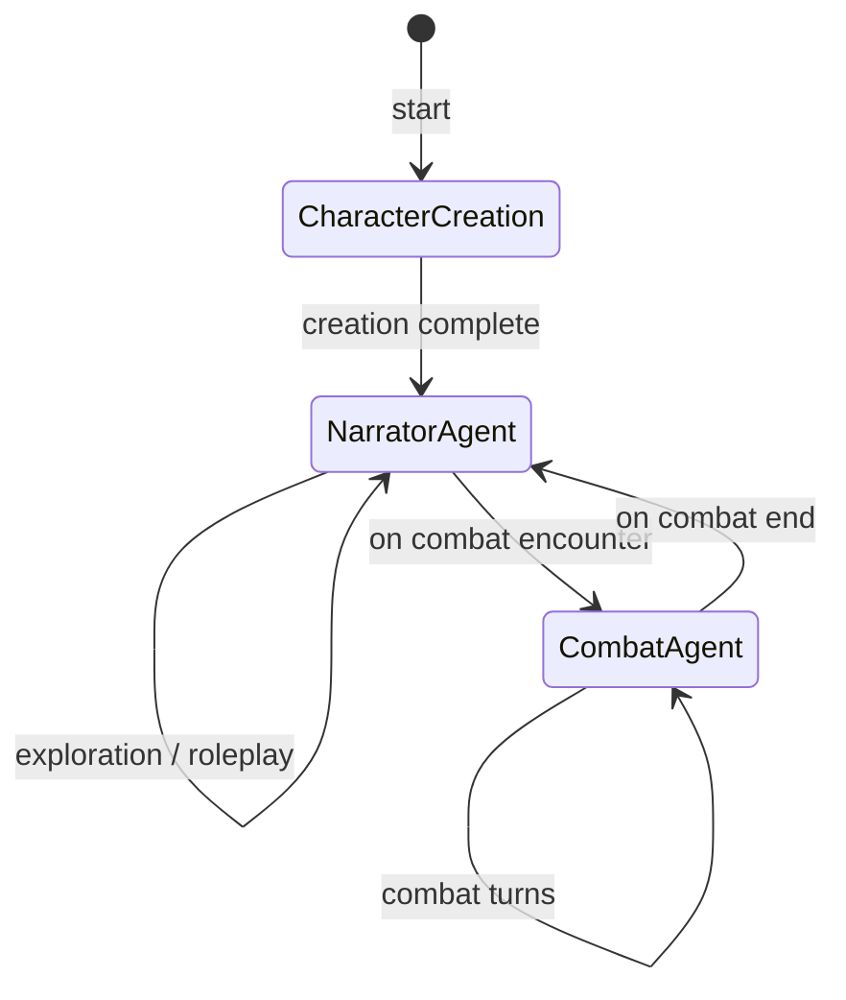

# Dungeons and Agents - Voice-Driven RPG

A voice-driven RPG built on LiveKit agents with Inworld TTS, showcasing narrator/combat switching, classic RPG mechanics, and persistent game state.

[](https://www.youtube.com/watch?v=1xm4f8HzBEI)

## Overview

**Dungeons and Agents** demonstrates an end-to-end voice-first RPG using LiveKit agents. Key features:

- **Multi-Agent System**: Seamless switching between a dramatic narrator agent and an action-focused combat agent
- **Character System**: Create and develop your character with classic RPG classes (Warrior, Mage, Rogue, Cleric)
- **D&D-Style Mechanics**: Dice rolling, skill checks, combat with initiative, and spell casting
- **Trading System**: Charisma‑based item and gold trading with NPCs
- **Dynamic NPC Inventories**: AI-driven item sets for NPCs based on role and context
- **Loot System**: Automatic loot transfer after combat (gold + inventory)
- **Voice-First Design**: Optimized for natural voice interactions without visual menus
- **Persistent State**: Character progression, inventory management, and story tracking via UserData

## Getting Started

### Prerequisites

- Python 3.10+
- LiveKit server running (or LiveKit Cloud account)
- API keys for:
  - OpenAI (for LLM)
  - Deepgram (for STT)
  - Inworld (for TTS)
  - Cerebras (for dynamic generation of NPCs and items)

### Installation

1. Install dependencies from the main `python-agents-examples` repo:
```bash
pip install -r requirements.txt
```

2. Set up environment variables in `.env`:
```env
LIVEKIT_URL=your-livekit-url
LIVEKIT_API_KEY=your-api-key
LIVEKIT_API_SECRET=your-api-secret
OPENAI_API_KEY=your-openai-key
DEEPGRAM_API_KEY=your-deepgram-key
INWORLD_API_KEY=your-inworld-key
CEREBRAS_API_KEY=your-cerebras-key
```

3. Run the agent:
```bash
python agent.py dev
```

4. Run the frontend
```bash
cd role_playing_frontend
pnpm install && pnpm dev
```

## How to Play

### Character Creation
When you first connect, the narrator will guide you through character creation:
- Say your character's name
- Choose a class: "I want to be a warrior/mage/rogue/cleric"

### Exploration Commands
- **"Look around"** - Get a description of your surroundings
- **"Go north/south/east/west"** - Move in a direction
- **"Talk to [NPC name]"** - Interact with NPCs
- **"Check my inventory"** - See what you're carrying
- **"Use [item name]"** - Use an item
- **"Start combat with [enemy]"** - Begin a combat encounter
  - Enemy types: goblin, orc, bandit, skeleton, dark mage, wolf
  - Can specify count: "Fight 3 goblins" or "Battle 2 orcs"

### Trading Commands
- **"Check [NPC]'s inventory"** - See what an NPC has for trade
- **"Trade with [NPC]"** - Propose a trade
  - Example: "Trade 20 gold for healing potion with the merchant"
  - Example: "Trade my dagger for their sword"
  - Trade success depends on offer value and your Charisma
### Loot & Trading Rules

#### Trade Mechanics
- Use `Check [NPC]'s inventory` and `Trade with [NPC]` to negotiate item/gold exchanges.
- Item values (approximate):
  - Weapons: 50 gold Armor: 75 gold
  - Consumables: 20 gold Miscellaneous: 10 gold (default 25 if unknown)
- Offer vs. request value determines Trade DC:
  - Offer ≥ 150% of request → DC 5 (very favorable to NPC)
  - Offer ≥ 100% of request → DC 10 (fair trade)
  - Offer ≥ 75% of request → DC 15 (slightly unfavorable)
  - Offer < 75% of request → DC 20 (very unfavorable)
- NPC rolls d20 + Charisma modifier against the DC:
  - Success → NPC accepts the trade.
  - Failure → NPC refuses with a random remark.

### Combat Commands
When combat begins, the agent automatically switches to the combat master:
- **"Attack [enemy name]"** - Attack a specific enemy
- **"Defend"** - Take a defensive stance
- **"Cast [spell name]"** - Cast a spell (mages and clerics)
- **"Use [item name]"** - Use an item in combat
- **"Flee"** - Attempt to escape
- **"Status"** - Check combat status

### Default Available Spells
- **Firebolt** (Mage) - Damage spell
- **Heal** (Cleric) - Restore health
- **Shield** (Mage) - Defensive buff

### Skill Checks
When you attempt actions like persuading NPCs, searching for secrets, or picking locks, the game performs skill checks:
- **Critical Success (Natural 20)**: Best possible outcome with bonus rewards
- **Success**: You achieve what you attempted
- **Failure**: Consequences based on how badly you failed
- **Critical Failure (Natural 1)**: Catastrophic failure - NPCs may become hostile!

The narrator interprets these results narratively, so failures have real consequences.

## Architecture

### Core Components

1. **`character.py`** — Character model and inventory/progression
   - `Character`, `PlayerCharacter`, `NPCCharacter`

2. **`game_mechanics.py`** — Game rules (dice rolls, combat, skills, spells)
   - `DiceRoller`, `Combat`, `SkillCheck`, `SpellCasting`, `GameUtilities`

3. **`agent.py`** — Agent entrypoint and RPCs
   - Registers RPC handlers (`get_current_context`, etc.)

4. **`narrator_agent.py`** — Explorer/narrator logic

5. **`combat_agent.py`** — Combat turn processing

6. **`core/game_state.py`** — `GameUserData` (shared state) & state summaries

7. **`generators/`** — AI-driven NPC and item generators

8. **`prompts/`**, **`rules/`**, and **`character_portraits.yaml`** — Configuration and prompt templates

### Agent Switching

The game switches between agents based on context:

```python
# When combat starts in NarratorAgent
async def _initiate_combat(self, context, enemies):
    # Initialize combat state
    userdata.combat_state = Combat.initialize_combat(player, enemies)
    # Return CombatAgent to trigger switch
    return CombatAgent()

# When combat ends in CombatAgent
async def _end_combat(self, context, victory):
    # Clean up combat state
    userdata.combat_state = None
    # Return NarratorAgent to go back to exploration
    return NarratorAgent()
```

### UserData Pattern

The `GameUserData` class maintains all game state across agent switches:

```python
@dataclass
class GameUserData:
    ctx: JobContext
    player_character: PlayerCharacter = None
    current_npcs: List[NPCCharacter] = field(default_factory=list)
    game_state: str = "character_creation"
    combat_state: Optional[CombatState] = None
    story_context: List[str] = field(default_factory=list)
```

## Data Flow and State Transitions

To visualize how the agents switch and how the shared `GameUserData` evolves, refer to the diagrams below.

### Agent State Transitions



### GameUserData Flow

```mermaid
graph LR
    subgraph Agents
      N[NarratorAgent]
      C[CombatAgent]
    end
    UD[GameUserData]
    N --> UD : update story_context, game_state
    UD --> N : properties: player_character, current_npcs
    N --> C : set combat_state
    C --> UD : update combat_state, story_context
    UD --> C : properties: combat_state, player_character
```

## Extending the Game

### Adding New Character Classes

1. Add the class to the `CharacterClass` enum in `character.py`
2. Set class-specific stats in `Character.__post_init__`
3. Add starting equipment in `create_character` function

### Adding New Spells

Add to the `SPELLS` dictionary in `game_mechanics.py`:

```python
"lightning_bolt": {
    "damage": "3d6",
    "type": "lightning",
    "range": "long",
    "description": "A bolt of lightning strikes multiple enemies"
}
```

### Adding New Locations

Extend the location graph in `explore_area`:

```python
locations = {
    "your_location": {
        "north": "connected_location",
        "secret_door": "hidden_room"
    }
}
```

### Custom NPCs

Create specialized NPCs with unique behaviors:

```python
merchant = NPCCharacter(
    name="Grimbold the Merchant",
    character_class=CharacterClass.ROGUE,
    disposition="friendly",
    merchant=True,
    merchant_inventory=[
        Item("magic_sword", "A gleaming blade", "weapon", {"damage": "1d8+2"}),
        Item("healing_potion", "Restores health", "consumable", {"healing": "2d4+2"})
    ]
)
```

## Voice Interaction Tips

The game is designed for natural voice interaction:

1. **Be conversational** - "I want to talk to the barkeep" works better than "talk barkeep"
2. **Use character names** - "Attack the goblin" instead of "attack"
3. **Descriptive actions** - "I'll defend myself" or "I'll try to run away"
4. **Natural pauses** - The agents will prompt you if they need more information

## Technical Notes

- Both agents share chat context for continuity
- State is preserved in UserData, not global variables
- Agent switching is handled by returning the new agent instance

## Troubleshooting

**"You need to create a character first!"**
- The game always starts with character creation
- Say your name and choose a class

**Combat seems stuck**
- Say "status" to check whose turn it is
- The agent processes NPC turns automatically

**Can't find an NPC**
- NPCs are created dynamically when mentioned
- Try different phrasings: "the barkeep", "bartender", etc.

## Example Gameplay

```
Narrator: "Welcome to Dungeons and Agents! What is your name, brave adventurer?"
Player: "My name is Marcus"
Narrator: "Excellent! What class would you like to play?"
Player: "I'll be a warrior"
Narrator: "Character created! Marcus the warrior stands ready..."

Player: "I look around"
Narrator: "The warm glow of the fireplace illuminates the tavern..."

Player: "I'll talk to the barkeep"
Narrator: "You approach the barkeep. They seem friendly..."

Player: "I'll explore north"
Narrator: "You travel north to the market square..."

[Combat encounter triggers]
Combat: "Combat begins! You face 2 goblins! Roll for initiative..."
Combat: "It's your turn! What do you do?"
Player: "I attack the first goblin"
Combat: "You strike with your sword! *rolls* Hit! 7 damage!"
```

## Credits

Built with:
- LiveKit Agents framework
- OpenAI for LLM
- Deepgram for speech-to-text
- Inworld for text-to-speech
