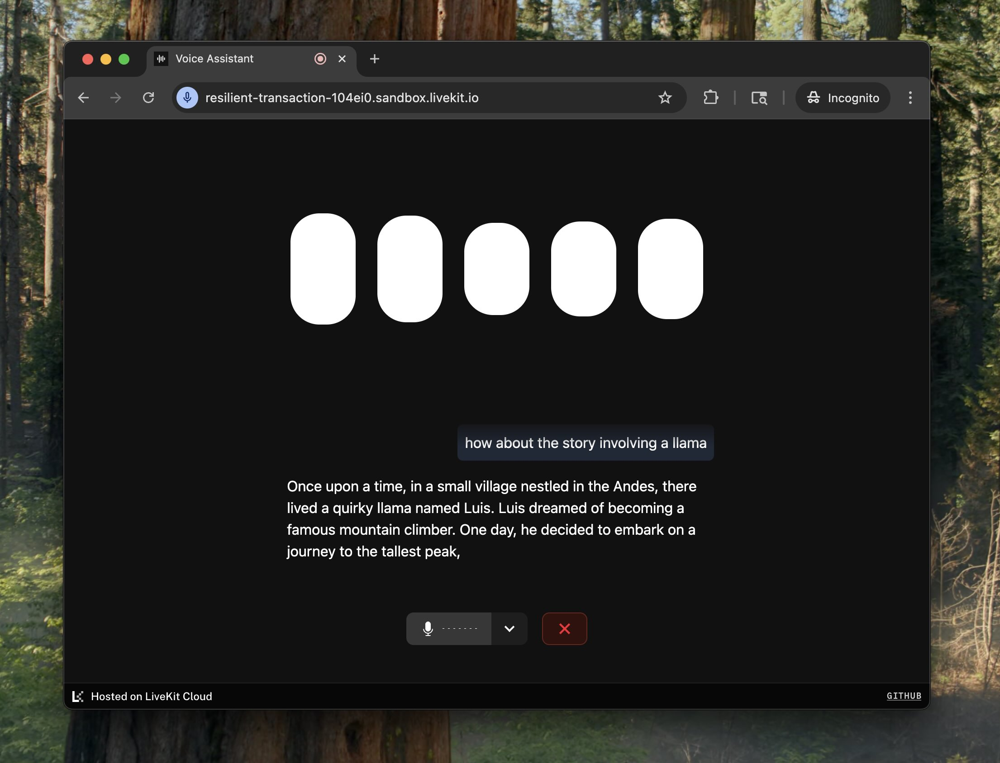

# Role-Playing Demo Frontend

This Next.js application is the UI for the **Dungeons and Agents** role-playing demo. It connects to the Python agent backend via RPC to present a voice-first RPG interface, complete with dynamically updating character portraits, game status, and voice interaction.



## Features

- **Character Portraits**: Portrait updates via RPC to reflect the current speaker (NPC or agent).
- **Game Status**: Displays health, inventory, equipped items, and combat turn queue.
- **Voice Chat & Transcription**: Speak commands and see live transcription of both user and agent voices.
- **Agent Video/Audio**: Show avatar video stream or audio visualizer depending on agent state.
- **Reactive UI**: Smooth animations handled by `framer-motion`.

## Getting Started

### Prerequisites

- Run the Python agent backend (`python agent.py`) under `complex-agents/role-playing` first.
- Node.js (v16+) or pnpm

### Install & Run

```bash
cd complex-agents/role-playing/role_playing_frontend
pnpm install
pnpm dev
```

Open http://localhost:3000 in your browser.

### Configuration

Copy `.env.example` to `.env.local` and adjust if needed:

```env
NEXT_PUBLIC_CONN_DETAILS_ENDPOINT=/api/connection-details
```

Make sure your backend and frontend endpoints align.

## Folder Structure

- `app/` — Next.js App Router (layouts, pages, API route for connection details)
- `components/` — React components (CharacterPortrait, GameStatus, SessionView)
- `hooks/` — Custom hooks for connection, transcription, debug
- `lib/` — Shared utilities and types
- `public/portraits/` — Portrait images for NPCs and agents
- `public/fonts/`, `postcss.config.js`, `tailwind.config.ts` — Styling and theming config